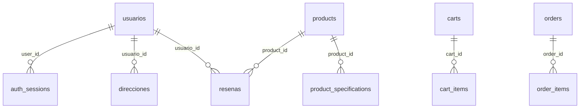

# LevelUP Backend - Documentacion de Base de Datos

## Como se genero el script

El archivo `init.sql` fue generado analizando las 11 entidades JPA (`@Entity`) distribuidas en 5 microservicios del proyecto. Se mapearon los tipos Java a tipos PostgreSQL segun el estandar de Hibernate 6.6.

## Entidades cubiertas

| Microservicio | Entidad Java | Tabla PostgreSQL | PK Type |
|---------------|-------------|-----------------|---------|
| authService | AuthSession | `auth_sessions` | UUID (String) |
| authService | Usuario | `usuarios` | VARCHAR (Firebase UID) |
| userService | Usuario | `usuarios` **(compartida)** | VARCHAR (Firebase UID) |
| userService | Direccion | `direcciones` | BIGSERIAL |
| productService | Product | `products` | INTEGER IDENTITY |
| productService | ProductSpecification | `product_specifications` | BIGSERIAL |
| productService | Resena | `resenas` | BIGSERIAL |
| cartService | Cart | `carts` | UUID |
| cartService | CartItem | `cart_items` | UUID |
| orderService | Order | `orders` | UUID |
| orderService | OrderItem | `order_items` | UUID |

**Total: 11 entidades -> 10 tablas** (usuarios es compartida entre authService y userService)

## Tablas compartidas entre microservicios

| Tabla | Microservicios que la usan | Detalle |
|-------|---------------------------|---------|
| `usuarios` | authService, userService, orderService, resenas (productService) | authService la crea al login. userService la actualiza. orderService y productService la referencian por user_id/usuario_id |

## Relaciones entre tablas

```
usuarios (authService + userService)
  |-- 1:N --> auth_sessions (authService)
  |-- 1:N --> direcciones (userService)
  |-- 1:N --> resenas (productService)
  |-- 1:N --> orders (orderService, ref logica por user_id)

products (productService)
  |-- 1:N --> product_specifications
  |-- 1:N --> resenas

carts (cartService)
  |-- 1:N --> cart_items

orders (orderService)
  |-- 1:N --> order_items
```

## Diagrama ER (Mermaid)



## Como ejecutar el script

### Opcion A: EC2-Data con PostgreSQL en Docker

1. **Crear la base de datos** (si no existe):
   ```bash
   docker exec -it postgres psql -U postgres -c "CREATE DATABASE lvlup_db;"
   ```

2. **Copiar el script al contenedor**:
   ```bash
   docker cp init.sql postgres:/tmp/init.sql
   ```

3. **Ejecutar el script**:
   ```bash
   docker exec -it postgres psql -U postgres -d lvlup_db -f /tmp/init.sql
   ```

4. **Verificar tablas creadas**:
   ```bash
   docker exec -it postgres psql -U postgres -d lvlup_db -c "\dt"
   ```

   Resultado esperado: 10 tablas.

### Opcion B: PostgreSQL local

```bash
psql -U postgres -d lvlup_db -f init.sql
```

### Opcion C: Montar como volumen en docker-compose (auto-init)

Si quieres que PostgreSQL ejecute el script al crear el contenedor por primera vez, monta el archivo en `/docker-entrypoint-initdb.d/`:

```yaml
services:
  postgres:
    image: postgres:16-alpine
    environment:
      POSTGRES_DB: lvlup_db
      POSTGRES_USER: postgres
      POSTGRES_PASSWORD: ${DB_PASSWORD}
    volumes:
      - pgdata:/var/lib/postgresql/data
      - ./init.sql:/docker-entrypoint-initdb.d/init.sql:ro
    ports:
      - "5432:5432"
```

> **Nota**: Los scripts en `docker-entrypoint-initdb.d/` solo se ejecutan cuando el volumen de datos esta vacio (primera vez).

## Notas importantes

- El script es **idempotente**: usa `DROP TABLE IF EXISTS ... CASCADE` para poder re-ejecutarse sin errores.
- **ADVERTENCIA**: Ejecutar en produccion con datos existentes **eliminara todos los datos**.
- `spring.jpa.hibernate.ddl-auto=none` en todos los microservicios, por lo que Hibernate NO creara ni modificara tablas automaticamente.
- Los campos UUID usan `gen_random_uuid()` como DEFAULT en PostgreSQL, pero Hibernate genera el UUID en Java antes del INSERT.
